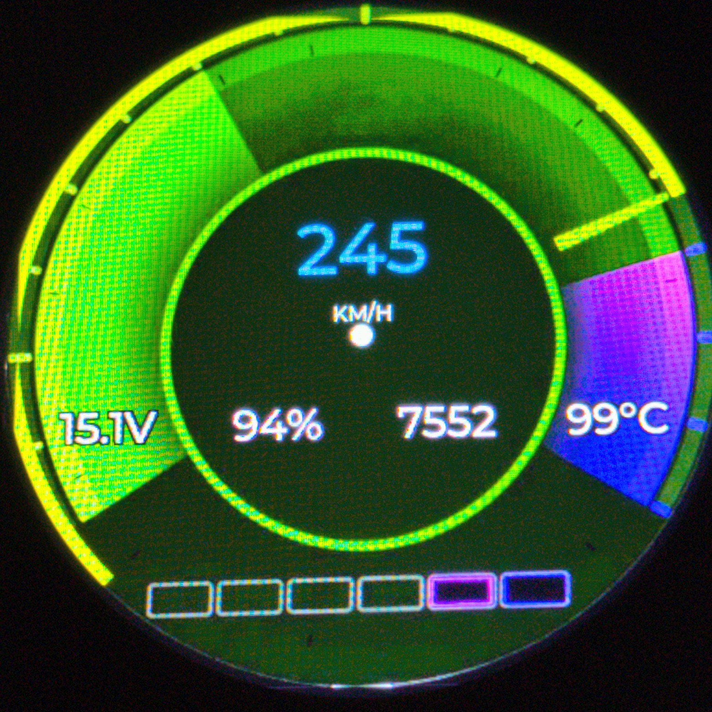

# BMW E90 OBD2 Display

ESP32-S3-basiertes CAN-Bus-Gauge-Display für einen BMW E90 320i (N43B20A, 2010).
Zeigt eine Multi-Daten-Kachel (Geschwindigkeit zentral, Kühlmitteltemperatur-Ring
im Hintergrund plus Batterie/Gaspedal/Drehzahl als Zusatzfelder) sowie
Kühlmitteltemperatur, Batteriespannung, Gaspedalstellung als analoge
Tacho-Style-Rundinstrumente (LVGL) mit Farbzonen, Drehzahl als
Schaltpunktanzeige (6 LEDs) sowie G-Kraft als Polar-Raster-Grafik auf einem
480×480 RGB-Touchdisplay an, inkl. Diagnose (DTCs lesen/löschen) und BMW
CBS-Service-Reset.



## Hardware

| Komponente | Modell |
|---|---|
| Mikrocontroller | ESP32-S3 (Waveshare ESP32-S3-Touch-LCD-2.1) |
| Display | ST7701S RGB-TFT, 480×480, über SPI-Init + paralleles RGB-Interface |
| Touch | CST820 (kapazitiv), I2C |
| IO-Expander | TCA9554 (Adresse 0x20) – steuert u. a. Touch-Reset/weitere Enable-Leitungen |
| CAN-Bus | externes **MCP2515-Modul** (SPI, TJA1050-Transceiver) oder alternativ **BLE-OBD-Adapter** (Veepeak OBDCheck BLE) |
| Batteriemessung | interner ADC (Spannungsteiler auf dem Board) |

Framework: **ESP-IDF** (nicht Arduino/PlatformIO), LVGL v8.2 via ESP Component
Manager.

## Pinbelegung

### ST7701S-Display (fest verlötet, keine externe Verdrahtung nötig)

| Signal | GPIO | Signal | GPIO |
|---|---|---|---|
| SPI SDA (Init) | 1 | SPI SCLK (Init) | 2 |
| HSYNC | 38 | VSYNC | 39 |
| DE | 40 | PCLK | 41 |
| Backlight (PWM) | 6 | | |
| B0–B4 (DATA0–4) | 5, 45, 48, 47, 21 | | |
| G0–G5 (DATA5–10) | 14, 13, 12, 11, 10, 9 | | |
| R0–R4 (DATA11–15) | 46, 3, 8, 18, 17 | | |

### I2C-Bus (Touch CST820 + IO-Expander TCA9554)

| Signal | GPIO |
|---|---|
| SCL | 7 |
| SDA | 15 |
| Touch-INT | 16 |
| Touch-RST | -1 (nicht verbunden, Reset über TCA9554) |

Ebenfalls fest verlötet, keine externe Verdrahtung nötig.

### MCP2515-CAN-Modul (extern anzuschließen)

**Wichtig:** Auf dem ESP32-S3-Touch-LCD-2.1 sind fast alle GPIOs durch das
RGB-Display und I2C belegt. Nur **GPIO 0, 19, 20, 43, 44** sind frei
herausgeführt.

| MCP2515-Modul | ESP32-S3 GPIO | Funktion |
|---|---|---|
| VCC | 3V3 | Versorgung |
| GND | GND | Masse |
| SCK | GPIO43 | SPI-Takt |
| SI (MOSI) | GPIO44 | SPI Data ESP→MCP2515 |
| SO (MISO) | GPIO19 | SPI Data MCP2515→ESP |
| CS | GPIO20 | SPI Chip-Select |
| INT | GPIO0 | Interrupt (Polling-Fallback möglich) |

**Achtung Pin-Konflikt:** GPIO43/44 sind gleichzeitig die UART-Konsole des
ESP32-S3 – mit dieser Belegung ist die serielle Debug-Ausgabe (`idf.py
monitor`) zur Laufzeit nicht nutzbar (Flashen funktioniert weiterhin über den
USB-Download-Modus). GPIO19/20 sind außerdem die nativen-USB-Pins – auch
diese Funktion steht dadurch nicht mehr zur Verfügung.

## Anschlussplan

```
                 +------------------+
                 |     ESP32-S3     |
                 | (Waveshare 2.1"  |
                 |  Touch-LCD)      |
                 +--------+---------+
                          |
     ------------------------------------------------
     |               |                              |
     v               v                              v
+---------+     +-----------+                 +-----------+
| Display |     |   Touch   |                 | MCP2515-  |
|ST7701S  |     | (CST820,  |                 | CAN-Modul |
| (RGB)   |     |  I2C)     |                 | (SPI)     |
+---------+     +-----------+                 +-----+-----+
                                                     |
                                          CANH/CANL |
                                                     v
                                          +----------------+
                                          |  OBD2-Stecker  |
                                          |  (BMW E90)     |
                                          |  Pin 6 = CANH  |
                                          |  Pin 14 = CANL |
                                          +----------------+
```

### MCP2515-Modul → CAN-Transceiver → OBD2-Stecker

Nach dem MCP2515 (SPI-Anschluss siehe oben) geht es weiter zum
CAN-Transceiver (meist TJA1050, schon auf dem Modul integriert) und von dort
zum BMW E90 OBD2-Stecker:

| OBD2-Pin | Signal |
|---|---|
| 6 | CANH |
| 14 | CANL |

- Baudrate: **500 kbit/s** (Quarz auf dem MCP2515-Modul muss passen, Standard
  8 MHz)
- Verbunden mit dem PT-CAN (Powertrain-CAN) des Fahrzeugs

## Software / Build

```bash
# Im Projektverzeichnis (ESP-IDF-Environment muss aktiviert sein, z. B. via
# `. $HOME/esp/esp-idf/export.sh`)
idf.py set-target esp32s3
idf.py build
idf.py -p PORT flash monitor
```

- **LVGL** wird per Component-Manager (`main/idf_component.yml`) geladen,
  Version 8.2.
- **Flash-Layout**: 16 MB, Zwei-Slot-OTA-Partitionstabelle (`ota_0`/`ota_1` à
  3 MB + `otadata`, siehe `partitions.csv`) – ein WLAN-Update schreibt immer
  in den gerade nicht laufenden Slot, ein fehlgeschlagener Upload überschreibt
  also nie die aktuell laufende Firmware.
- **CI**: `.github/workflows/build-s3.yml` baut das Projekt per
  `espressif/esp-idf-ci-action` (ESP-IDF v5.3.1, Target `esp32s3`) und lädt
  bei Push auf `test_waveshare` drei Dateien in das GitHub-Release
  **`s3-latest`** sowie zusätzlich versioniert in **`v<Version>`**
  (Version aus `VERSION`):
  - **`firmware-s3-update.bin`** – reines App-Image, für das **WLAN-Update**
    (siehe unten). Name bewusst mit `_update`-Suffix, damit er sich nicht mit
    der `-merged.bin` verwechseln lässt.
  - **`firmware-s3.elf`** – fürs Debugging (Backtrace-Symbole).
  - **`firmware-s3-merged.bin`** – Bootloader + Partitionstabelle + App,
    gemerged an den Offsets `0x0`/`0x8000`/`0x20000`, nur fürs **initiale
    USB-Flashen** gedacht (`esptool write-flash 0x0 firmware-s3-merged.bin`).

## WLAN-Firmware-Update (OTA)

Im originalen Waveshare-Onboard-Panel (3 Sekunden Touch in der
Bildschirmmitte → dort wo auch Helligkeit/SD-Größe/RTC stehen) gibt es einen
Schalter **„WLAN-Update“**. Aktiviert er:

1. Das Display baut einen eigenen WLAN-Access-Point auf
   (SSID `BMW-E90-OTA`, Passwort `bmw320i2010`) und zeigt einen **QR-Code**
   zum direkten Verbinden an (iOS-Kamera/Android-Scanner), dazu SSID/Passwort/
   IP als Text sowie einen Fortschrittsbalken.
2. Handy/PC verbindet sich mit diesem WLAN (per QR-Code-Scan oder manuell)
   und ruft `http://192.168.4.1` im Browser auf.
3. Dort **nur die Datei `firmware-s3-update.bin`** auswählen und hochladen –
   **nicht** die `-merged.bin`, die ist ausschließlich fürs USB-Flashen.
4. Nach erfolgreichem Upload schreibt das Display `esp_ota_set_boot_partition`
   und startet automatisch in die neue Firmware neu.

**Schutz vor der falschen Datei:** `main/OTA_Web/ota_web.c` liest nach den
ersten paar hundert empfangenen Bytes den App-Beschreibungsblock
(`esp_app_desc_t`) aus der gerade beschriebenen Partition zurück
(`esp_ota_get_partition_description`). Fehlt dort das erwartete
`ESP_APP_DESC_MAGIC_WORD` – z. B. weil versehentlich die `-merged.bin`
hochgeladen wurde, bei der an dieser Stelle der Bootloader statt des
App-Headers steht – bricht der Upload sofort mit einer Fehlermeldung ab,
statt eine ungültige Firmware zu flashen.

**Wichtig:** Da `partitions.csv` ein Zwei-Slot-OTA-Layout ist, muss nach
einer Änderung der Partitionstabelle selbst einmal regulär per USB geflasht
werden – danach funktioniert das WLAN-Update für alle folgenden Versionen.

## RTC-Zeitabgleich per SNTP über Hotspot

Die eingebaute PCF85063-RTC braucht einmalig eine korrekte Uhrzeit (z. B.
für Zeitstempel im CSV-Logging und im SD-Log). Dafür gibt es im
Funktionen-Screen (siehe UI-Logik unten) den Schalter **„Hotspot
verbinden“**. Das ist ein eigenes, unabhängiges WLAN-Feature – **nicht** zu
verwechseln mit dem WLAN-Update-Access-Point (`BMW-E90-OTA`) oben: Hier
verbindet sich das Display selbst als **Client** mit einem WLAN, das
Internetzugang hat (z. B. Handy-Hotspot oder Heim-WLAN).

**Ablauf:**
1. Zugangsdaten stehen (bewusst nicht im Code, dieses Repo ist öffentlich)
   in der Textdatei `/sdcard/wifi-einstellungen.txt` auf der SD-Karte. Fehlt
   sie noch, legt der erste Verbindungsversuch automatisch eine Vorlage mit
   Erklärung/Beispiel an – Karte am PC entnehmen, `SSID=...` und
   `PASSWORT=...` eintragen, Karte zurückstecken.
2. Schalter **„Hotspot verbinden“** im Funktionen-Screen aktivieren.
   **Es wird nie automatisch beim Boot gesucht** – nur nach diesem bewussten
   Tastendruck, damit das BLE-OBD-Polling nicht unbeabsichtigt (z. B.
   während der Fahrt) gestört wird.
3. Das Display pausiert kurz die BLE-OBD-Verbindung (teilt sich dieselbe
   2,4-GHz-Antenne), verbindet sich mit dem hinterlegten WLAN, synct die Zeit
   per SNTP (`pool.ntp.org`) und schreibt sie lokal (inkl. Sommerzeit) in die
   RTC. Darunter zeigt ein Statustext den Fortschritt
   („Verbinde…“, „Zeit abgeglichen“, „Hotspot nicht erreichbar“, …).
4. Der Schalter fällt nach dem (einmaligen) Versuch automatisch wieder ab –
   er ist kein dauerhafter „verbunden“-Zustand. Mit einer RTC-Pufferbatterie
   reicht ein einziger erfolgreicher Abgleich, die Zeit bleibt danach auch
   über Stromverluste hinweg erhalten.
5. Der Schalterzustand selbst wird **nicht** in NVS gespeichert – nach jedem
   Neustart ist er wieder aus.

## OBD2 / CAN-Auswertung (MCP2515-Quelle)

Läuft über `main/CAN_Driver/` (eigener MCP2515-SPI-Treiber + Decode-Task,
kein ESP-IDF-`twai`). CAN-IDs sind **Platzhalter**, am Fahrzeug per
CAN-Sniffer verifizieren:

| CAN-ID | Inhalt |
|---|---|
| `0x0AA` | Drehzahl (Byte 2–3 LE × 0,25 = U/min) |
| `0x0C4` | G-Kraft (Byte 0/1 int8 × 0,01 = g) + Geschwindigkeit (Byte 2–3 LE × 0,1 = km/h) |
| `0x1D0` | Kühlmitteltemperatur (Byte 0 − 40 = °C) |
| `0x1F0` | Gaspedalstellung (Byte 0 linear 0–255 → 0–100 %) |
| `0x7DF` | OBD2-Funktionsadresse (DTC lesen/löschen, Mode 03/04) |
| `0x611` | Kombiinstrument (CBS-Öl-Service-Reset, UDS Service `0x31`) |

Solange kein CAN-Signal anliegt, zeigt die UI Platzhalterwerte/Testanimation
an. Das Board-Akku-Feld kommt vom internen ADC, nicht von CAN. Die
Fahrzeug-Batteriespannung im Multi-View wird per Mode-01-PID-0x42-Anfrage
(1×/s) live über OBD2 ausgelesen. DTC-Antworten (`0x7E8`, Mode 03) werden zu
Klartext-Codes decodiert (nur Single-Frame-ISO-TP, kein Multi-Frame-
Reassembly).

## Datenquelle: BLE-OBD oder MCP2515

Das Display kann seine Live-Daten aus zwei Quellen beziehen. Die Auswahl
erfolgt im Demo-Menü (**3 Sekunden Touch in der Bildschirmmitte**) über die
Buttons **„BLE OBD“** und **„MCP“** (aktive Quelle grün). **Standard ist
BLE OBD.** Die Wahl gilt für alle Live-Werte, DTC-Lesen/-Löschen,
Service-Reset und das CSV-Logging.

| Quelle | Hardware | Modul |
|---|---|---|
| **BLE OBD** (Standard) | ELM327-Adapter mit Bluetooth LE, z. B. **Veepeak OBDCheck BLE** | `main/BLE_OBD/` |
| **MCP** | MCP2515-Modul direkt am PT-CAN (siehe Verdrahtung oben) | `main/CAN_Driver/` |

### BLE-OBD-Adapter (Veepeak OBDCheck BLE)

- Der ESP32-S3 hat nur **Bluetooth 5 LE**, kein klassisches Bluetooth
  (BR/EDR/SPP). Adapter, die nur klassisches Bluetooth sprechen (z. B.
  Veepeak **VP11**), können deshalb **nicht** verbunden werden – es muss ein
  BLE-Adapter sein.
- Beim Start initialisiert das Display Bluetooth und scannt fortlaufend nach
  Geräten, deren Name `OBD`, `VEEPEAK`, `VLINK` oder `ELM327` enthält
  (Groß-/Kleinschreibung egal). Der Veepeak-Adapter meldet sich als
  **VEEPEAK**. Bei Fund wird automatisch verbunden.
- Die GATT-Charakteristiken (Notify = RX, Write = TX) werden generisch
  erkannt, da ELM327-Klone unterschiedliche UUIDs verwenden.
- **Kopplung:** Bei BLE ist normalerweise keine Kopplung nötig (Sicherheit:
  `ESP_LE_AUTH_NO_BOND`). Verlangt ein Adapter dennoch eine PIN, probiert das
  Display nacheinander **1234 → 5678 → 0000**.
- Nach dem Verbinden: `ATZ`, `ATE0`, `ATH0`, `ATSP6` (ISO 15765-4 CAN,
  500 kbit/s), danach zyklisches Polling per Standard-OBD2:
  Drehzahl, Geschwindigkeit, Kühlmitteltemperatur, Gaspedalstellung,
  Batteriespannung (`ATRV`) sowie DTC lesen/löschen (Mode 03/04) und
  Service-Reset.
- **Einschränkung:** G-Kraft ist über Standard-OBD2 nicht verfügbar und
  bleibt bei BLE-OBD auf 0,0 – dafür wird die MCP-Quelle benötigt.
- Der BLE-Scan startet erst ca. 7 s nach dem Boot, um den bestehenden Scan
  der Waveshare-Demo (`Wireless.c`) nicht zu stören.
- Ein BLE-Adapter benötigt **keine** Verdrahtung – GPIO19/20/43/44 bleiben bei
  reiner BLE-Nutzung frei (MCP2515 dann nicht anschließen).

## UI-Logik (Kurzfassung)

- **Boot-Logo**: Direkt nach der LVGL-Initialisierung zeigt das Display
  1,8 Sekunden lang ein Vollbild-Logo auf schwarzem Grund
  (`main/BMW_UI/boot_logo_img.c/.h`, 480×480 RGB565), bevor die eigentliche
  UI (Demo-Screen + BMW-Multi-Ansicht) aufgebaut wird.
- **Multi-Kachel**: Geschwindigkeit zentral, Ring zeigt wahlweise
  Kühlmitteltemperatur (Skala 40–119 °C) oder Drehzahl (0–8000 U/min) –
  umschaltbar im Funktionen-Screen (siehe unten). Um die Nadel herum wächst
  ein Farbring mit: Neongelb bis zur Warnschwelle (Wasser 100 °C / Drehzahl
  6500 U/min), danach Orange, ab der Alarmschwelle (Wasser 115 °C / Drehzahl
  6900 U/min) Rot. Im Wasser-Modus blinkt die Nadel zusätzlich ab 112 °C.
  Drehzahl ist außerdem immer digital sichtbar (großer Font). Zusatzfelder:
  Board-Akku-Spannung (ADC), Gaspedal, Drehzahl, Wasser-Temperatur – alle mit
  schmaler schwarzer Umrandung für bessere Lesbarkeit – dazwischen mittig,
  tiefer versetzt, die live per OBD2 ausgelesene Fahrzeug-Batteriespannung.
- **Schaltpunkt-Kästchen** (6 Stück, Drehzahl-Kachel): füllen sich einzeln je
  nach Drehzahl (Schwellen 1500/2500/3500/4500/5500/6500 U/min), ab
  6800 U/min blinken alle gemeinsam wie eine digitale Schaltanzeige.
- **Wisch nach links** auf der Multi-Ansicht öffnet den Fehlercode-Screen:
  oben eine scrollbare Liste der ausgelesenen DTCs (Klartext, z. B. „P0301“),
  darunter „Auslesen“/„Löschen“ nebeneinander sowie „Service Reset“ (CBS-
  Öl-Service). **Wisch nach rechts** führt zurück zur Multi-Ansicht.
- **Wisch nach rechts** auf der Multi-Ansicht öffnet den Screen „SERVICE“ mit
  Buttons für weitere OBD2-Routinen (Oil reset, Brake reset, Brake Bleed,
  NOx Regen – die letzten beiden sind mangels bestätigter BMW-Diagnosebefehle
  aktuell nicht hinterlegt). **Wisch nach rechts** auf diesem Screen öffnet
  den Screen „SENSOREN“ (reine Digitalwert-Anzeige, 4 Zeilen × 2 Spalten):
  Lambda Sensor 1/2 (Kraftstoff-Luft-Äquivalenzverhältnis) oben, darunter
  deren Spannungswerte, darunter Ansaugkrümmerdruck (MAP) und Ladedruck,
  unten Nockenwellen-Position Einlass/Auslass. Lambda und Ansaugdruck kommen
  live per Standard-OBD2-PID (0x24/0x25/0x0B) von der eingestellten
  Datenquelle; Ladedruck und Nockenwellen-Position zeigen immer „n/v“, da der
  N43B20A laut `CLAUDE.md` keinen Turbo hat und es für beides ohnehin keine
  standardisierte bzw. keine Mode-01-PID gibt (VANOS-Position wäre nur per
  BMW-spezifischem UDS-Identifier auslesbar, nicht verifiziert). Die
  Zuordnung „Lambda 1/2“ zu „Bank 1/2“ ist eine Annahme – beim N43 als
  Reihenmotor mit nur einer Bank vermutlich eher Sensor vor/nach Kat
  derselben Bank, am Fahrzeug noch zu verifizieren. **Wisch nach links**
  führt zurück zu „SERVICE“, von dort weiter zurück zur Multi-Ansicht.
- **3 Sekunden Touch in der Bildschirmmitte** zeigt den Waveshare-Demo-Screen
  (dort auch der Schalter für das **WLAN-Firmware-Update**, siehe oben), ein
  „Zurück“-Button führt zur BMW-Ansicht zurück.
- **Doppeltipp** in der Mitte öffnet den Einstellungs-Screen
  (Primär-/Sekundärfarbe, wirkt sich auf alle Anzeigen und die Nadelfarbe
  aus). **Wisch nach rechts** auf diesem Screen öffnet „FUNKTIONEN“: Schalter
  für SD-Karten-Datenlogging (CSV, Excel-kompatibel), Umschalter
  Wasser/Drehzahl für die große Multi-Kachel-Anzeige, ein Warnsummer
  (Buzzer), der bei Kühlmitteltemperatur ≥ 120 °C auslöst (ein-/ausschaltbar),
  sowie der Schalter **„Hotspot verbinden“** für den einmaligen RTC-
  Zeitabgleich per SNTP (siehe eigener Abschnitt oben, nicht gespeichert,
  startet bei jedem Boot wieder aus). **Wisch nach links** führt zurück zu
  den Farben.

Details zur BMW-Multi-Ansicht siehe `CLAUDE.md` im Repo-Root sowie die
projektspezifischen Notizen unter `2.1 LCD/demo projekt/esp-idf -
ESP32-S3-Touch-LCD-2.1-Test/README.md`.

## Lizenz

GPL-3.0, siehe [LICENSE](LICENSE).
